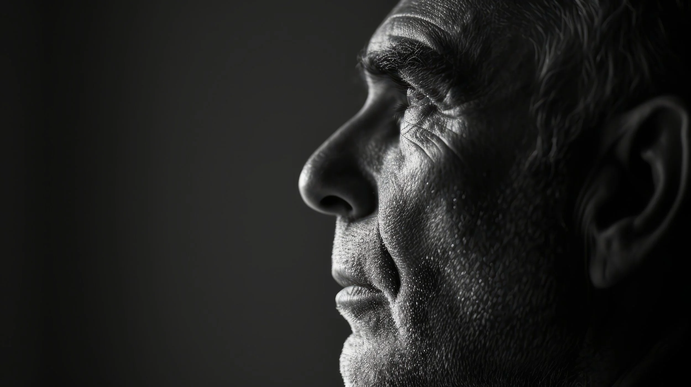

Quando uma pessoa sofre um AVC (Acidente Vascular Cerebral) ou um trauma craniano, os impactos vão muito além dos sinais físicos visíveis. A mente também enfrenta desafios que podem afetar desde a memória e a atenção até a capacidade de tomar decisões e gerenciar as emoções. Nesses casos, a **reabilitação cognitiva** surge como um caminho essencial para recuperar funções perdidas e ajudar o paciente a retomar sua vida.

## O Que é a Reabilitação Cognitiva?
A reabilitação cognitiva é um conjunto de estratégias e exercícios voltados para recuperar ou compensar funções cognitivas que foram prejudicadas por uma lesão cerebral. Isso inclui atividades que estimulam áreas como:

### Memória 
Treinamento para recuperar a habilidade de lembrar informações importantes do dia a dia.
### Atenção 
Exercícios que ajudam a pessoa a se concentrar em uma tarefa específica sem se distrair.
### Raciocínio Lógico e Resolução de Problemas 
Atividades que estimulam o cérebro a pensar de forma mais clara e eficaz.
### Funções Executivas
Melhora na capacidade de planejar, organizar e tomar decisões.

Cada caso é único, e a reabilitação é personalizada de acordo com o tipo de lesão e as necessidades do paciente. O objetivo é sempre a **autonomia**, permitindo que a pessoa recupere a capacidade de realizar tarefas diárias, retomar sua vida social e, muitas vezes, voltar ao trabalho.

## Como a Reabilitação Cognitiva Ajuda?
Após um AVC ou trauma craniano, o cérebro precisa de tempo e estímulo para se reorganizar. A reabilitação cognitiva atua justamente nesse processo, promovendo a neuroplasticidade — a capacidade do cérebro de criar novas conexões neuronais para compensar áreas afetadas pela lesão.

Imagine o cérebro como uma estrada: em uma lesão cerebral, algumas "estradas" ficam bloqueadas, dificultando a passagem da informação. A reabilitação cognitiva trabalha para criar "desvios", ajudando o cérebro a encontrar novos caminhos para realizar as mesmas tarefas.

## Uma Abordagem Gradual e Individualizada
Um dos principais pilares da reabilitação cognitiva é que ela precisa ser gradual e individualizada. Não existe uma fórmula única para todos os pacientes. Cada pessoa apresenta uma combinação única de dificuldades, o que significa que o processo de recuperação deve ser adaptado às necessidades específicas.

### Etapa Inicial
Avaliação neuropsicológica completa para mapear quais áreas cognitivas foram afetadas e qual o grau de comprometimento.
### Planejamento Personalizado
A partir dos resultados da avaliação, é elaborado um plano de reabilitação com atividades focadas nas funções prejudicadas.
### Acompanhamento Constante
O progresso é acompanhado de perto, com ajustes sendo feitos conforme o paciente avança na recuperação.

Esse processo gradual respeita o tempo de recuperação de cada paciente e foca na **autonomia** — ou seja, na capacidade do paciente de voltar a realizar as tarefas que mais importam para ele, seja no trabalho, nas atividades diárias ou nas interações sociais.

## Foco na Autonomia: Retomar a Vida em Suas Mãos

Um dos maiores benefícios da reabilitação cognitiva é a possibilidade de recuperar a **autonomia**. Muitas vezes, após uma lesão cerebral, o paciente sente que perdeu o controle sobre sua própria vida. A incapacidade de lembrar pequenas coisas, de se concentrar em uma conversa ou de tomar decisões simples pode gerar frustração e isolamento.

Com a reabilitação cognitiva, o paciente vai reconquistando, passo a passo, sua capacidade de realizar as tarefas que lhe dão independência. Desde ações mais simples, como lembrar de compromissos, até as mais complexas, como voltar ao trabalho, a reabilitação oferece ao paciente a possibilidade de retomar a vida em suas mãos.

## A Importância do Suporte Emocional na Recuperação
A reabilitação cognitiva não envolve apenas o trabalho das funções mentais. O processo de recuperação é muitas vezes desafiador e emocionalmente exaustivo para o paciente e seus familiares. Por isso, o suporte emocional desempenha um papel crucial. Durante a reabilitação, os pacientes são incentivados a lidar com as frustrações de maneira saudável, entendendo que o progresso pode ser gradual, mas cada conquista conta.

## Um Caminho Para Mais Qualidade de Vida
A reabilitação cognitiva é muito mais do que uma terapia para o cérebro; é uma ponte que leva o paciente de volta à vida que ele merece. Cada avanço, por menor que pareça, representa um passo na direção da recuperação de sua autonomia e qualidade de vida.
