Estamos localizados em Araruama/RJ e contamos com infraestrutura para atendimento a todas as idades. O ambiente foi especialmente projetado para proporcionar conforto e aconchego a todos os nossos clientes e parceiros.

**Possuímos acessos sem degraus e com elevadores para melhor acessibilidade.**

## Nosso Espaço


  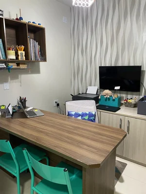
  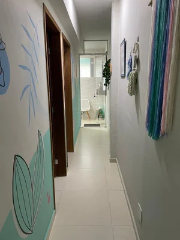
  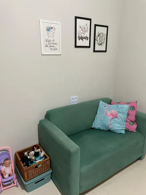
  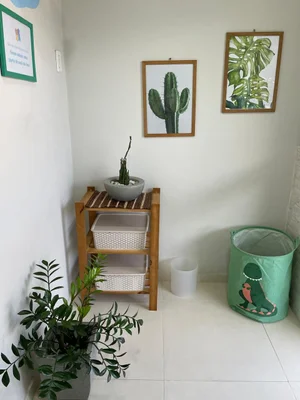
  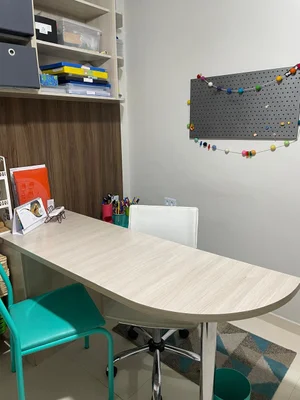
  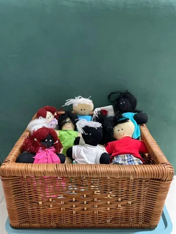
  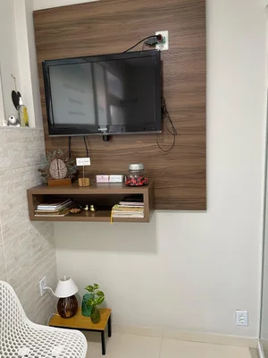
  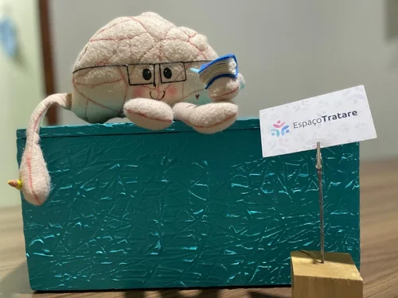
  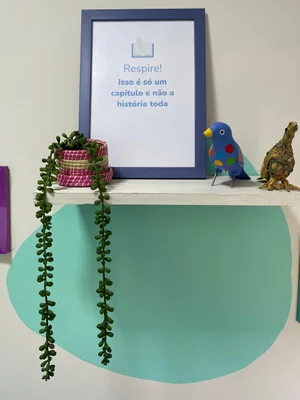
  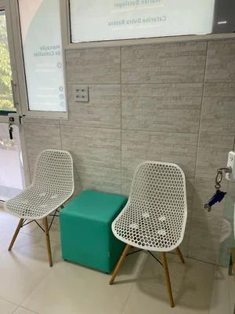
  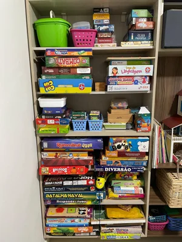
  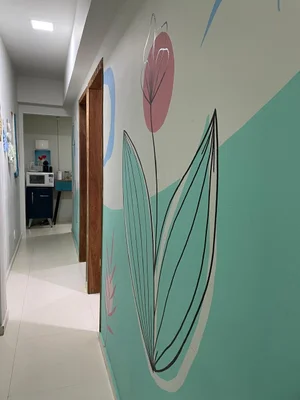


 

<iframe class="gmap_iframe" frameborder="0" scrolling="no" marginheight="0" marginwidth="0" src="https://maps.google.com/maps?width=600&amp;height=400&amp;hl=en&amp;q=espaço tratare araruama&amp;t=&amp;z=16&amp;ie=UTF8&amp;iwloc=B&amp;output=embed"></iframe><a href="https://embed-googlemap.com">embed google maps in website</a>

---

## Nossa Equipe

### Verônica Lemos

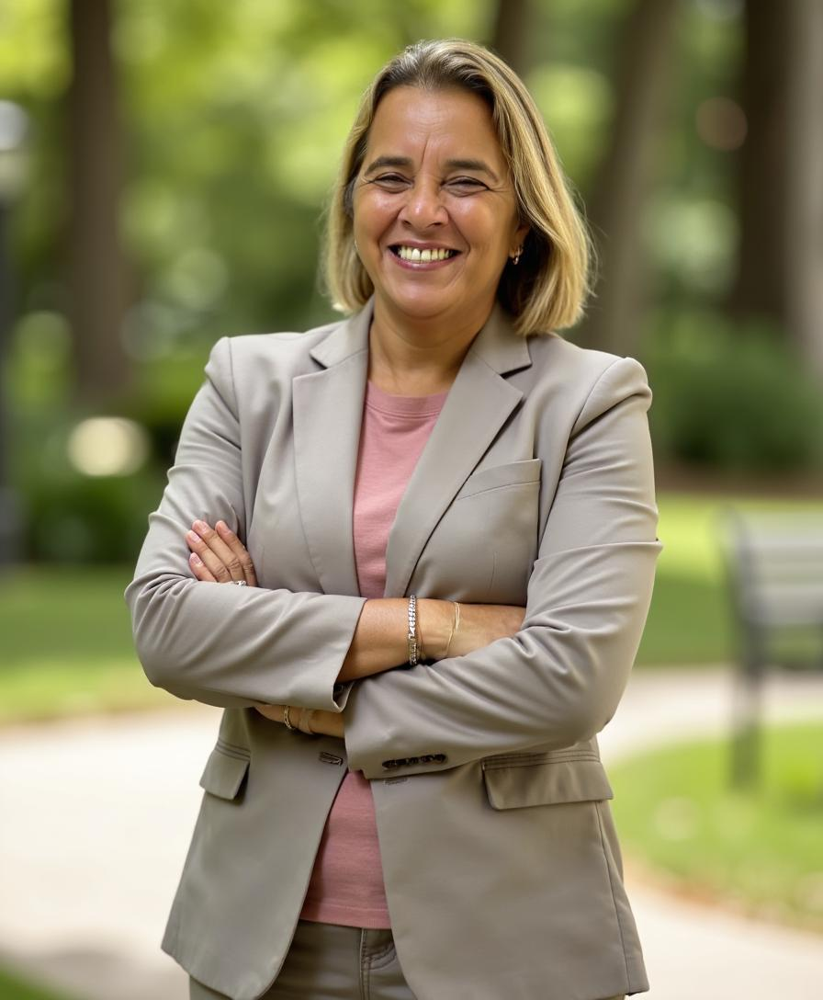

**Psicóloga Clínica e Neuropsicóloga**

Verônica Lemos (CRP 05/25884) atua em Araruama/RJ desde 1999, com trajetória consolidada na psicologia clínica e, desde 2012, dedicação à neuropsicologia. Possui MBA em Reabilitação Neuropsicológica e Desenvolvimento Cognitivo, com formação voltada à compreensão aprofundada do funcionamento cognitivo e emocional ao longo da vida.

Realiza avaliação neuropsicológica com investigação criteriosa de atenção, memória, linguagem, funções executivas, aprendizagem e aspectos socioemocionais, integrando entrevistas clínicas, instrumentos padronizados e informações escolares e familiares quando pertinentes. O processo é conduzido com rigor técnico e devolutiva clara, oferecendo direcionamentos objetivos para família, escola e profissionais envolvidos.

Também desenvolve intervenções em reabilitação e estimulação cognitiva, com planos individualizados voltados à autonomia, organização do cotidiano e melhora do desempenho funcional.

### Márlen Bussinger

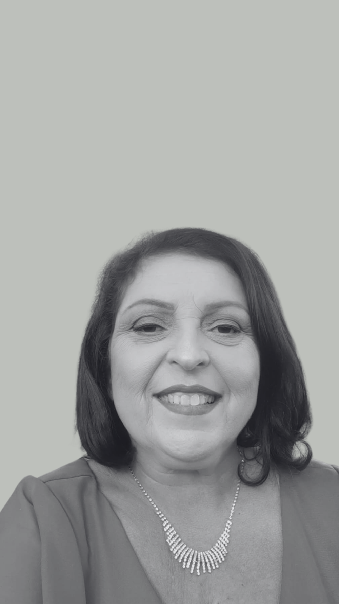

**Psicopedagoga e Neuropsicóloga Educacional**

Márlen Bussinger é Psicopedagoga e Neuropsicóloga Educacional no Espaço TRATARE. Mineira e mãe de dois filhos, ela é apaixonada por sua profissão e se sente motivada pelo impacto positivo que seu trabalho tem no aprendizado e comportamento de seus pacientes.

Formada em Letras Português/Inglês, Márlen iniciou sua carreira como professora na rede pública e particular de Minas Gerais. Em 2006, inspirada por sua experiência como mãe de uma criança com TDAH, ela se especializou em Psicopedagogia para melhor apoiar seu filho e outras crianças com condições neurotípicas. Fundou o núcleo de estudos ACOMPANHAR, oferecendo aulas particulares com visão psicopedagógica para alunos com transtornos de aprendizagem e comportamentais.

Márlen também cursou Neuropsicologia Educacional e trabalhou como Coordenadora de Ensino Fundamental e Psicopedagoga Institucional, ampliando sua experiência educacional. Em 2011, conheceu Verônica e juntas fundaram o Espaço TRATARE, que ao longo de 13 anos tem proporcionado avaliações psicopedagógicas e neuropsicológicas, bem como tratamentos individualizados para pacientes com TEA, TDAH, transtornos de aprendizagem e outros transtornos do neurodesenvolvimento.

---

## Depoimentos

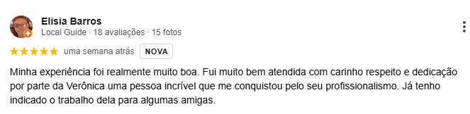
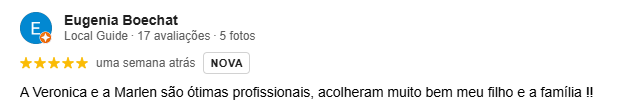

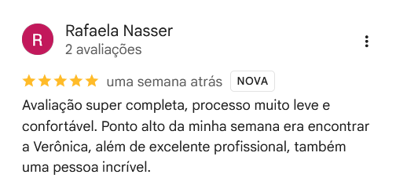
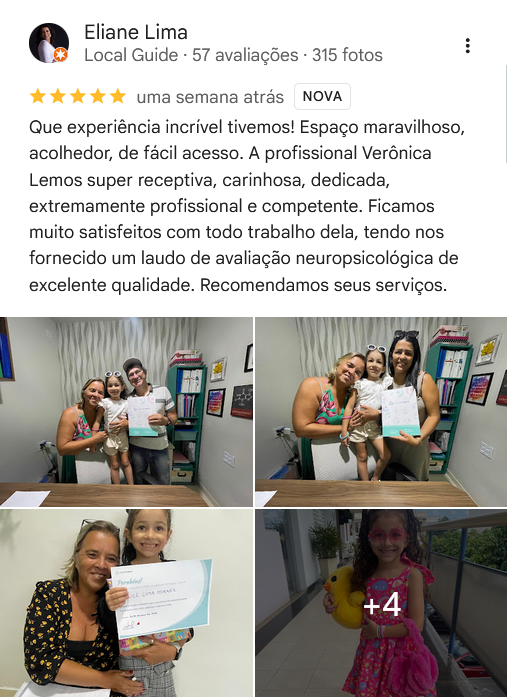
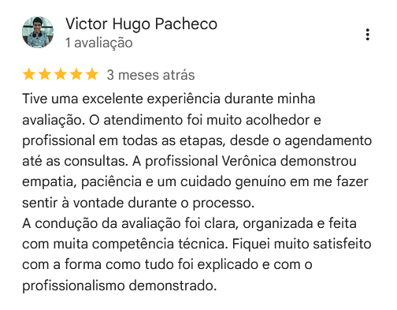
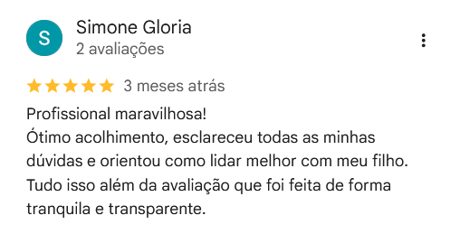

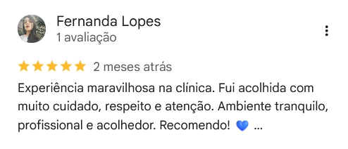
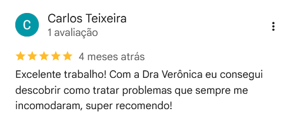
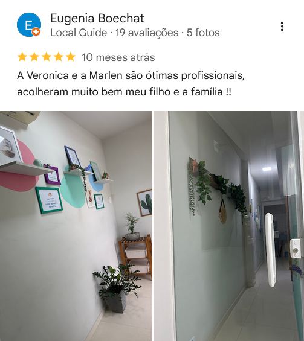
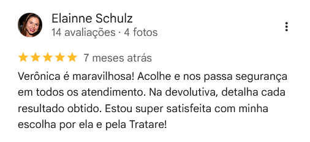
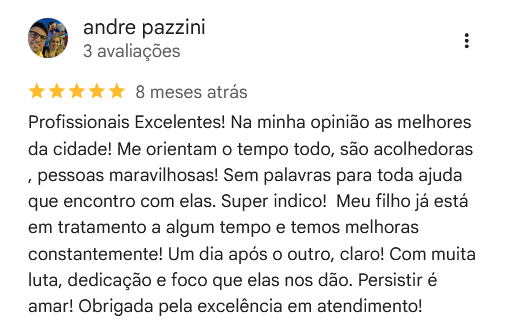
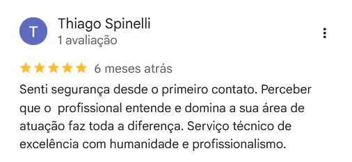
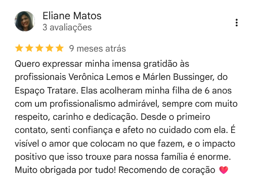
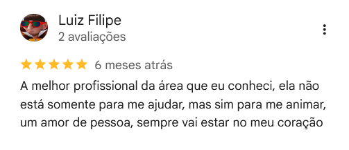
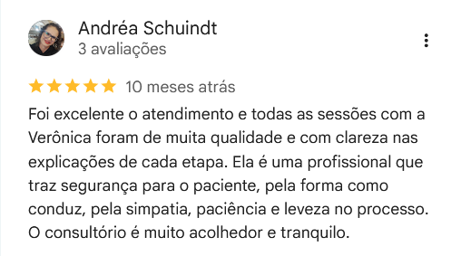
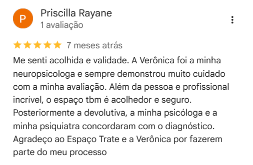

