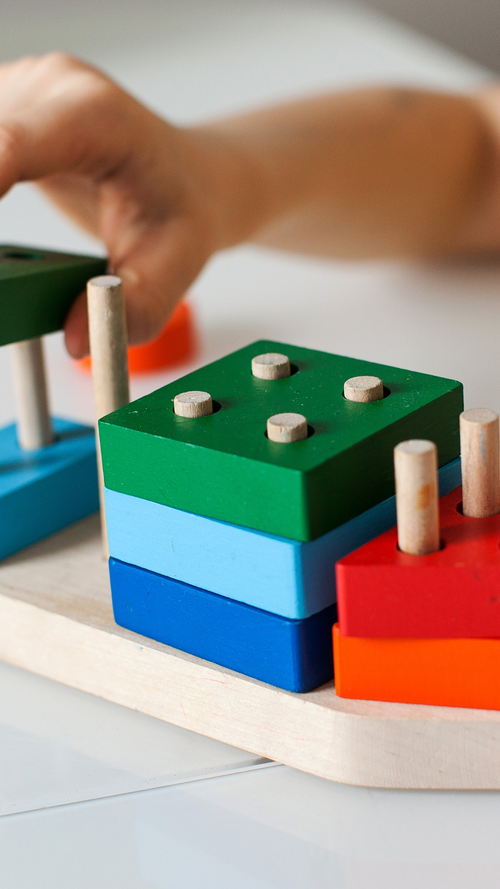
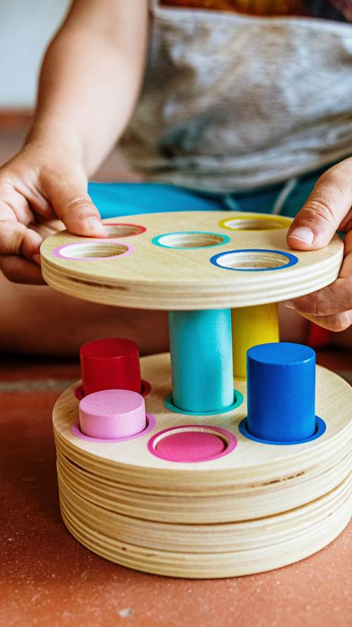
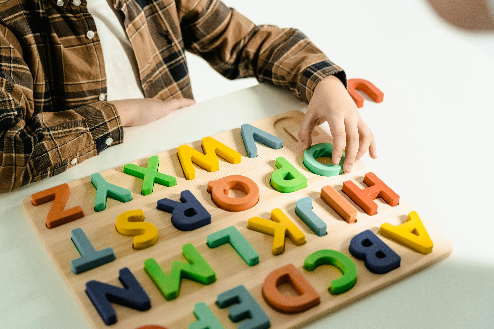

No Espaço Tratare, oferecemos serviços de Psicopedagogia dedicados a identificar e intervir nas dificuldades de aprendizagem, promovendo o desenvolvimento acadêmico e emocional dos nossos pacientes. Nossa abordagem é personalizada, considerando as necessidades únicas de cada indivíduo e trabalhando em conjunto com suas famílias e escolas.

## O que é Psicopedagogia?

A Psicopedagogia é uma área que une conhecimentos da Psicologia e da Pedagogia para compreender e tratar os processos de aprendizagem e suas dificuldades. Psicopedagogos atuam na prevenção, diagnóstico e intervenção em problemas que podem afetar o desempenho escolar e o desenvolvimento cognitivo e emocional.

---

## Nossos Serviços de Psicopedagogia

#### Avaliação Psicopedagógica
Realizamos avaliações completas para identificar dificuldades de aprendizagem, transtornos comportamentais e de neurodesenvolvimento. Utilizamos testes padronizados, observações e entrevistas para elaborar um diagnóstico preciso e um plano de intervenção eficaz.

#### Intervenção Psicopedagógica
Desenvolvemos planos de intervenção personalizados que podem incluir atividades lúdicas, técnicas pedagógicas diferenciadas e estratégias para melhorar habilidades cognitivas, sociais e emocionais. Trabalhamos em parceria com a família e a escola para garantir que o aluno receba suporte consistente e contínuo.

#### Apoio Escolar
Oferecemos suporte adicional para alunos com dificuldades específicas, ajudando-os a superar obstáculos acadêmicos e melhorar seu desempenho escolar. Este serviço inclui orientação de estudos, técnicas de memorização, organização do tempo e métodos de leitura e escrita.

#### Orientação para Pais e Educadores
Fornecemos orientação e treinamento para pais e educadores, ajudando-os a entender as dificuldades do aluno e a adotar estratégias eficazes de apoio. Realizamos workshops, palestras e sessões individuais para capacitar os envolvidos no processo educativo.

---

## Benefícios da Psicopedagogia

#### Identificação Precoce
Detecta dificuldades de aprendizagem e transtornos comportamentais desde cedo, permitindo intervenções rápidas e eficazes.

#### Intervenção Personalizada
Planos de intervenção adaptados às necessidades específicas de cada aluno, promovendo um desenvolvimento acadêmico e emocional equilibrado.

#### Apoio Multidisciplinar
Trabalhamos em conjunto com psicólogos, neuropsicólogos e outros profissionais para oferecer um suporte completo e integrado.

#### Melhoria do Desempenho Escolar
Ajudamos os alunos a superar dificuldades, desenvolver habilidades essenciais e alcançar seu pleno potencial acadêmico.

#### Apoio Continuado
Oferecemos suporte contínuo, acompanhando o progresso do aluno e ajustando as intervenções conforme necessário para garantir resultados duradouros.

No **Espaço Tratare**, nossa missão é proporcionar um ambiente acolhedor e estimulante, onde cada aluno possa desenvolver suas capacidades ao máximo. Acreditamos que, com o apoio certo, todos têm o potencial de superar desafios e alcançar o sucesso acadêmico e pessoal. Estamos comprometidos em fazer a diferença na vida dos nossos pacientes e suas famílias, promovendo uma aprendizagem significativa e transformadora.

 


Entre em contato


  


  
  
  
  
  


---
