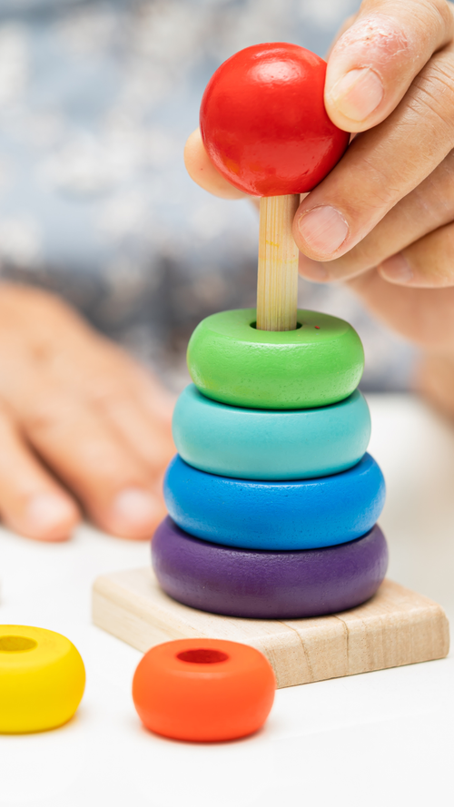
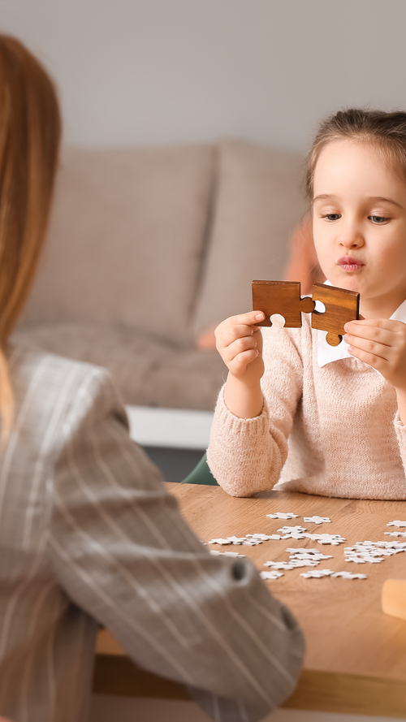
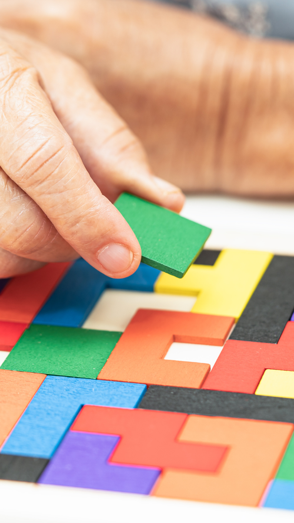

A Reabilitação Neuropsicológica no Espaço Tratare é um processo terapêutico especializado, focado na recuperação e melhoria das funções cognitivas afetadas por lesões cerebrais, doenças neurodegenerativas, ou outras condições neurológicas. Este serviço é cuidadosamente adaptado às necessidades individuais de cada paciente, com o objetivo de promover a autonomia e a qualidade de vida.

---

## Como Funciona a Reabilitação Neuropsicológica

#### Avaliação Inicial
Realizamos uma avaliação detalhada das funções cognitivas do paciente para identificar áreas comprometidas e preservadas. Este diagnóstico é fundamental para o planejamento do tratamento.

#### Planejamento Personalizado
Desenvolvemos um plano de intervenção personalizado, baseado nos resultados da avaliação inicial. Este plano inclui metas específicas e estratégias de reabilitação adaptadas às necessidades e capacidades do paciente.

#### Intervenção Terapêutica
Utilizamos diversas técnicas e métodos terapêuticos para estimular e melhorar funções cognitivas como memória, atenção, linguagem, percepção e habilidades executivas. As sessões são conduzidas por profissionais experientes em Neuropsicologia.

#### Acompanhamento Contínuo
Monitoramos regularmente o progresso do paciente, ajustando o plano de tratamento conforme necessário para garantir os melhores resultados possíveis. O acompanhamento contínuo permite adaptações e melhorias constantes na abordagem terapêutica.

#### Envolvimento Familiar
Encorajamos a participação e o envolvimento da família no processo de reabilitação. Oferecemos orientações e suporte para que os familiares possam contribuir positivamente para o progresso do paciente.

#### Resultados Esperados
A reabilitação neuropsicológica visa melhorar a independência funcional do paciente, ajudando-o a desenvolver estratégias para superar dificuldades cognitivas e a melhorar seu desempenho em atividades diárias.

No **Espaço Tratare**, nossa equipe dedicada trabalha com compromisso e expertise para oferecer um atendimento de alta qualidade, promovendo uma recuperação eficiente e uma vida mais independente para nossos pacientes.

 


Entre em contato


  


  
  
  
  
  


---


